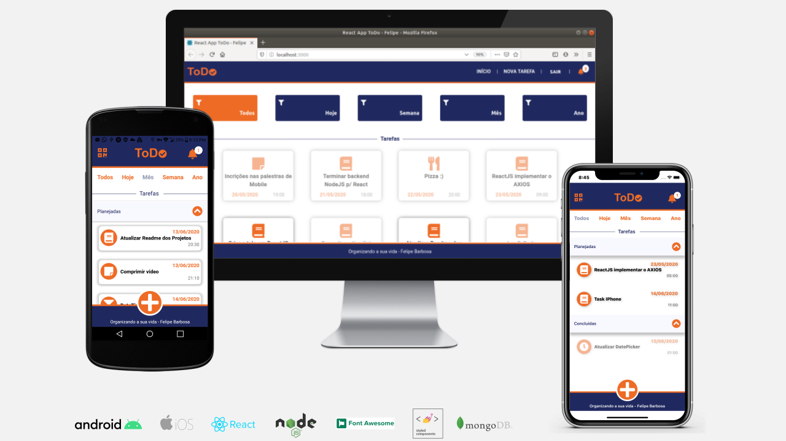

# react-native-front
Projeto TODO para estudo do React Native utilizando a api com NodeJS e MongoDB 


## Cross Platform com React & React Native



Projeto web em React se encontra em outro repositório, aqui somente o mobile ;)

## Android & iOS


## Instalação
```
  Iniciando o projeto
    npm install -g expo-cli
    expo init nome_projeto
    expo start
    cd nome_projeto
    npm start # you can open iOS, Android, or web from here, or run them directly with the commands below.
     npm run android
     npm run ios # requires an iOS device or macOS for access to an iOS simulator
     npm run web
```

Em `src/services/api` altere/atualize o IP do seu backend. Por exemplo, somente para o emulador Android `const baseURL = 'http://10.0.2.2:3333'`;


## #KeepRocking
* #fullstack
* #mobile
* #react
* #nodejs
* #mongodb


### Udemy

Curso criado por Rodrigo Gonçalves Santana, link:

https://www.udemy.com/course/projeto-completo-xd-nodejs-mongodb-react-native-e-react/